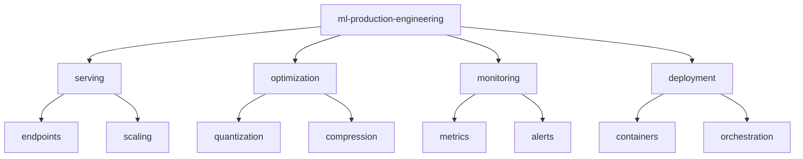

# ML Production Engineering ⚙️

[](https://www.python.org/downloads/)
[](https://onnx.ai)
[](https://www.docker.com/)
[](https://developer.nvidia.com/cuda-toolkit)
[](LICENSE)

> End-to-end machine learning deployment and optimization solutions. Focused on model serving, optimization, and production-grade ML system implementation.

[Features](#features) • [Installation](#installation) • [Quick Start](#quick-start) • [Documentation](#documentation) • [Contributing](#contributing)

## 📑 Table of Contents
- [Features](#features)
- [Project Structure](#project-structure)
- [Prerequisites](#prerequisites)
- [Installation](#installation)
- [Quick Start](#quick-start)
- [Documentation](#documentation)
  - [Deployment](#deployment)
  - [Optimization](#optimization)
  - [Benchmarks](#benchmarks)
- [Contributing](#contributing)
- [Versioning](#versioning)
- [Authors](#authors)
- [Citation](#citation)
- [License](#license)
- [Acknowledgments](#acknowledgments)

## ✨ Features
- Model optimization and quantization
- Containerized deployment
- Multi-GPU serving strategies
- A/B testing infrastructure
- Monitoring and observability

## 📁 Project Structure



<details>
<summary>Click to expand full directory structure</summary>

```plaintext
ml-production-engineering/
├── serving/           # Model serving components
│   ├── endpoints/    # API endpoints
│   └── scaling/      # Scaling utilities
├── optimization/     # Model optimization
│   ├── quantization/ # Model quantization
│   └── compression/  # Model compression
├── monitoring/       # Monitoring tools
├── deployment/       # Deployment configs
├── tests/           # Unit tests
└── README.md        # Documentation
```
</details>

## 🔧 Prerequisites
- Python 3.8+
- CUDA 11.8+
- Docker 24.0+
- Kubernetes 1.24+
- NVIDIA GPU (Compute Capability 6.0+)

## 📦 Installation

```bash
# Clone repository
git clone https://github.com/BjornMelin/ml-production-engineering.git
cd ml-production-engineering

# Create environment
python -m venv venv
source venv/bin/activate

# Install dependencies
pip install -r requirements.txt
```

## 🚀 Quick Start

```python
from mlprod import optimization, serving

# Optimize model
optimized_model = optimization.quantize_model(
    model,
    backend="tensorrt",
    precision="fp16"
)

# Deploy model
deployment = serving.ModelDeployment(
    model=optimized_model,
    scaling_config={
        "min_replicas": 2,
        "max_replicas": 10
    }
)

# Launch service
deployment.deploy()
```

## 📚 Documentation

### Deployment Patterns

| Pattern | Use Case | Scalability | Complexity |
|---------|----------|-------------|------------|
| REST API | Online Inference | High | Low |
| Batch Processing | Offline Inference | Very High | Medium |
| Streaming | Real-time Processing | High | High |

### Optimization Techniques
- Model quantization (INT8/FP16)
- Model pruning and distillation
- TensorRT optimization
- Batch inference optimization

### Benchmarks
Production performance metrics:

| Metric | Value | Environment | Load |
|--------|-------|-------------|------|
| Latency P95 | 25ms | K8s + GPU | 1000 RPS |
| Throughput | 5000 RPS | Auto-scaled | Peak |
| Memory Usage | 4GB/pod | Optimized | Steady |

## 🤝 Contributing
- [Contributing Guidelines](CONTRIBUTING.md)
- [Code of Conduct](CODE_OF_CONDUCT.md)
- [Development Guide](DEVELOPMENT.md)

## 📌 Versioning
We use [SemVer](http://semver.org/) for versioning. For available versions, see the [tags on this repository](https://github.com/BjornMelin/ml-production-engineering/tags).

## ✍️ Authors
**Bjorn Melin**
- GitHub: [@BjornMelin](https://github.com/BjornMelin)
- LinkedIn: [Bjorn Melin](https://linkedin.com/in/bjorn-melin)

## 📝 Citation
```bibtex
@misc{melin2024mlproductionengineering,
  author = {Melin, Bjorn},
  title = {ML Production Engineering: Production-Grade ML Systems},
  year = {2024},
  publisher = {GitHub},
  url = {https://github.com/BjornMelin/ml-production-engineering}
}
```

## 📄 License
This project is licensed under the MIT License - see the [LICENSE](LICENSE) file for details.

## 🙏 Acknowledgments
- ONNX community
- TensorRT team
- Kubernetes community

---
Made with ⚙️ and ❤️ by Bjorn Melin
